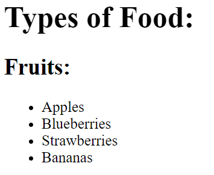

## Básicos React

- Evitar utilizar la palabra *class* para definir clases en **HTML**, en su lugar emplear *className* de esta forma se evitan confusiones con la palabra reservada *class* en Javascript.
- Por convensión todos los atributos de HTML se referencias en JSX con camelCase


## JSX 
JSX retorna un unico elemento. si quiero procesar varios a la vez deben estar envueltos dentro de un elemento padre para cumplir con este principio.

### JSX válido 
```html
<div>
  <p>Paragraph One</p>
  <p>Paragraph Two</p>
  <p>Paragraph Three</p>
</div>
```

### JSX NO válido 
```html
<p>Paragraph One</p>
<p>Paragraph Two</p>
<p>Paragraph Three</p>
```

## Comentarios 

`` {/* comentario aquí */} ``

## Renderizado

React contiene una API de renderizado conocida como ReactDOM

`` ReactDOM.render(componentToRender, targetNode) ``

El primer argumento corresponde con un elemento o un componente que se quiera renderizar y el segundo en nodo del DOm donde se quiere renderizar.

**Ejemplo**


```javascript

const JSX = (
  <div>
    <h1>Hello World</h1>
    <p>Lets render this to the DOM</p>
  </div>
);


ReactDOM.render(JSX, document.getElementById("challenge-node"))

```
---
## Componentes en React

1. Componente sintaxis de función  

Se trata de funciones que devuelven **un elemento** a ser renderizado en el DOM. Estas funciones se hacen reutilizables cuando le pasamos parámetros.

 **IMPORTANTE!** el nombre de esta función debe comenzar con mayúscula

 ```Javascript
const DemoComponent = function() {
  return (
    <div className='customClass' />
  );
};
 ```

2. Componentecon sintaxis de clase
   
```javascript
  class Kitten extends React.Component {
  constructor(props) {
    super(props);
  }

  render() {
    return (
      <h1>Hi</h1>
    );
  }
}

```


 ### Multiples componentes de React

Normalmente se crea un componente padre llamado de normal **App** que renderiza cada uno de los otros componentes (hijos)

```javascript
return (
 <App>
  <Navbar />
  <Dashboard />
  <Footer />
 </App>
)
```

**Componentes anidados**
```javascript
const TypesOfFruit = () => {
  return (
    <div>
      <h2>Fruits:</h2>
      <ul>
        <li>Apples</li>
        <li>Blueberries</li>
        <li>Strawberries</li>
        <li>Bananas</li>
      </ul>
    </div>
  );
};

const Fruits = () => {
  return (
    <div>
      { /* Change code below this line */ }
      <TypesOfFruit />
      { /* Change code above this line */ }
    </div>
  );
};

class TypesOfFood extends React.Component {
  constructor(props) {
    super(props);
  }

  render() {
    return (
      <div>
        <h1>Types of Food:</h1>
        { /* Change code below this line */ }
           <Fruits />
        { /* Change code above this line */ }
      </div>
    );
  }
}; 


```
Resultado



---

## Propiedades o Props en React

Las props son los argumentos que se le pasan al componente de React que se está creando.
Puedo definirlas explicitamente dentro del componente o poner solo **props** y luego acceder a ellas como si de objetos se tratara 

Ejemplo 1
``` javascript

const Welcome = (props) => <h1>Hello, {props.user}!</h1>

<App>
  <Welcome user='Mark' />
</App>

```

Ejemplo 2

``` javascript
const CurrentDate = (props) => {
  return (
    <div>
      { /* Change code below this line */ }
      <p>The current date is: {props.date} </p>
      { /* Change code above this line */ }
    </div>
  );
};

class Calendar extends React.Component {
  constructor(props) {
    super(props);
  }
  render() {
    return (
      <div>
        <h3>What date is it?</h3>
        { /* Change code below this line */ }
        <CurrentDate date={Date()} />
        { /* Change code above this line */ }
      </div>
    );
  }
};
```

### Definir propiedades por defecto

Las propiedades por defecto son valores predeterminados que defino que se utilizarán en caso de que no se especifique ningun valor para dicha propiedad

```Javascript
const ShoppingCart = (props) => {
  return (
    <div>
      <h1>Shopping Cart Component</h1>
    </div>
  )
};
// Change code below this line

ShoppingCart.defaultProps = {
  items: 0
};
```

### Definir test tipo de dato de una prop.

Esto es util en caso de que una prop provenga de una API por ejemplo y lo que esté esperando como valor sea un array, de no venir un array causaría un error por lo que puedo garantizar que lo que esté viniendo lo sea definiendo *propTypes*

```Javascript
MyComponent.propTypes = { handleClick: PropTypes.func.isRequired }
```

En el ejemplo anterior se garantiza que lo que venga sea una funcion

Para **propTypes** booleanos utilizo *bool*, el resto no cambian 

Es necesario importar propTypes independiente de react para que pueda funcionar

``import PropTypes from 'prop-types';``

En caso de que el componente hijo sea The ES6 class component.

debo acceder a las propiedades de modo diferente:
``{this.props.data}``

```javascript
class App extends React.Component {
  constructor(props) {
    super(props);

  }
  render() {
    return (
        <div>
            { /* Change code below this line */ }
            <Welcome name='Yoannet'/>
            { /* Change code above this line */ }
        </div>
    );
  }
};

class Welcome extends React.Component {
  constructor(props) {
    super(props);

  }
  render() {
    return (
        <div>
          { /* Change code below this line */ }
          <p>Hello, {this.props.name} <strong></strong>!</p>
          { /* Change code above this line */ }
        </div>
    );
  }
};
```

---
## Estados en React

Se definen dentro de componentes declarados con clases

se declara como sigue:

``this.state = {}``

Ver declarado dentro de un componente 

```javascript
class StatefulComponent extends React.Component {
  constructor(props) {
    super(props);
    // Only change code below this line
    this.state = {
    firstName : "Yoannet"
    }
    // Only change code above this line
  }
  render() {
    return (
      <div>
        <h1>{this.state.firstName}</h1>
      </div>
    );
  }
};
```

Otra forma de acceder al state es a traves de variables dentro del método render(). 

Notar que que el codigo java script lo puedo poner sin {}, esto es posible porque no estoy dentro del return

```javascript
class MyComponent extends React.Component {
  constructor(props) {
    super(props);
    this.state = {
      name: 'freeCodeCamp'
    }
  }
  render() {
    // Change code below this line
 const name = this.state.name;
    // Change code above this line
    return (
      <div>
        { /* Change code below this line */ }
        <h1>{name}</h1>
        { /* Change code above this line */ }
      </div>
    );
  }
};
```


para modificar el *state* debe hacerse a traves del método *setState()*

quedar'ia algo así 

``this.setState({
  username: 'Lewis'
});``

Visto en un ejemplo:

```javascript
class MyComponent extends React.Component {
  constructor(props) {
    super(props);
    this.state = {
      name: 'Initial State'
    };
    this.handleClick = this.handleClick.bind(this);
  }
  handleClick() {
    this.setState({name:"React Rocks!"})
  }
  render() {
    return (
      <div>
        <button onClick={this.handleClick}>Click Me</button>
        <h1>{this.state.name}</h1>
      </div>
    );
  }
};
```
La siguiente línea
``this.handleClick = this.handleClick.bind(this);``

Permite que cuando se llame a la funcion ``this.setState()`` dentro del método ``handleClick()``, el *this* se refiera a la clase y no devuelva indefinido.

## Usar state para dar asincronía a un elemento

```javascript
class MyComponent extends React.Component {
  constructor(props) {
    super(props);
    this.state = {
      visibility: false
    };
    // Change code below this line
     this.toggleVisibility = this.toggleVisibility.bind(this);
    // Change code above this line
  }
  // Change code below this line
  toggleVisibility() {
    this.setState(state => {
      if (state.visibility === true) {
         return { visibility: false };
       } else {
         return { visibility: true };
      }
    });
  }
  // Change code above this line
  render() {
    if (this.state.visibility) {
      return (
        <div>
          <button onClick={this.toggleVisibility}>Click Me</button>
          <h1>Now you see me!</h1>
        </div>
      );
    } else {
      return (
        <div>
          <button onClick={this.toggleVisibility}>Click Me</button>
        </div>
      );
    }
  }
}
```

Ejercicio
Contador incremento decremento 

```Javascript
class Counter extends React.Component {
  constructor(props) {
    super(props);
    this.state = {
      count: 0
    };
    
    this.increment = this.increment.bind(this);
    this.decrement = this.decrement.bind(this);
    this.reset = this.reset.bind(this);
    
  }
  //si dependo de un valor anterior acceder al setState de esta forma (evento asincrono)
    increment(){
       this.setState(state=>{
         return state.count++
       });
    }
    decrement(){
       this.setState(state=>{
         return state.count--;
       });
    }
//cuando no necesito conocer el valor anterior accedo al setState de esta forma, cambio directamente lo que quiero
    reset(){
      this.setState({
       count: 0
        
      })
    }

  render() {
    return (
      <div>
        <button className='inc' onClick={this.increment}>Increment!</button>
        <button className='dec' onClick={this.decrement}>Decrement!</button>
        <button className='reset' onClick={this.reset}>Reset</button>
        <h1>Current Count: {this.state.count}</h1>
      </div>
    );
  }
};
```

Ejercicio: Mostrar entrados desde un imput

```javascript
class ControlledInput extends React.Component {
  constructor(props) {
    super(props);
    this.state = {
      input: ''
    };
    // Change code below this line
 this.handleChange = this.handleChange.bind(this);
    // Change code above this line
  }
  // Change code below this line
handleChange(event){
  this.setState({
    input:event.target.value
 });
}
  // Change code above this line
  render() {
    return (
      <div>
        { /* Change code below this line */}
<input value={this.state.input} onChange={this.handleChange} />
        { /* Change code above this line */}
        <h4>Controlled Input:</h4>
        <p>{this.state.input}</p>
      </div>
    );
  }
};
```

El value dentro del input lo utilizo para conectar el estado inicial con el input. O sea lo que ponga en *state.input* se verá en el input 

Ejercicio: Tomar valor de un input y mostrarlo luego de darle al boton submit!

```Javascript
class MyForm extends React.Component {
  constructor(props) {
    super(props);
    this.state = {
      input: '',
      submit: ''
    };
    this.handleChange = this.handleChange.bind(this);
    this.handleSubmit = this.handleSubmit.bind(this);
  }
  handleChange(event) {
    this.setState({
      input: event.target.value
    });
  }
  handleSubmit(event) {
    // Change code below this line
event.preventDefault();
this.setState({submit: this.state.input})

    // Change code above this line
  }
  render() {
    return (
      <div>
        <form onSubmit={this.handleSubmit}>
          {/* Change code below this line */}
<input value={this.state.input} onChange={this.handleChange} />
          {/* Change code above this line */}
          <button type='submit' onClick={this.handleSubmit}>Submit!</button>
        </form>
        {/* Change code below this line */}
<h1>{this.state.submit}
</h1>
        {/* Change code above this line */}
      </div>
    );
  }
}
```

Ejercicio

Pasar porpiedades de un hijo otro mediante un componente padre que rederiza ambos hijos.

```javascript
class MyApp extends React.Component {
  constructor(props) {
    super(props);
    this.state = {
      inputValue: ''
    }
    this.handleChange = this.handleChange.bind(this);
  }
  handleChange(event) {
    this.setState({
      inputValue: event.target.value
    });
  }
  render() {
    return (
       <div>
        { /* Change code below this line */ }
<GetInput input={this.state.inputValue} handleChange = {this.handleChange} />
<RenderInput input={this.state.inputValue} />
        { /* Change code above this line */ }
       </div>
    );
  }
};

class GetInput extends React.Component {
  constructor(props) {
    super(props);
  }
  render() {
    return (
      <div>
        <h3>Get Input:</h3>
        <input
          value={this.props.input}
          onChange={this.props.handleChange}/>
      </div>
    );
  }
};

class RenderInput extends React.Component {
  constructor(props) {
    super(props);
  }
  render() {
    return (
      <div>
        <h3>Input Render:</h3>
        <p>{this.props.input}</p>
      </div>
    );
  }
};
```

---

# Lifecycle methods

``componentDidMount()`` y 

- APIs

Una buena pr'actica en React es colocar los llamados a las APIs dentro de este tipo de método.

Cuando se llama una API desde el método y se configura el *state* con el dato de la API, este automáticamente se actualizará 

Este ejercicio llama *mock API* dentro del *componentDidMount()*
El objetivo es hacer una peticion del total de usuarios activos y los muestra pasados 2.5 segundos 

  ```Javascript
  class MyComponent extends React.Component {
  constructor(props) {
    super(props);
    this.state = {
      activeUsers: null
    };
  }
  componentDidMount() {
    setTimeout(() => {
      this.setState({
        activeUsers: 1873
      });
    }, 2500);
  }
  render() {
    return (
      <div>
        {/* Change code below this line */}
        <h1>Active Users:{this.state.activeUsers} </h1>
        {/* Change code above this line */}
      </div>
    );
  }
}
  ```

- EventListener
  *componentDidMount()* es un buen lugar para ubicar eventListener que necesite

  ```javascript
   class MyComponent extends React.Component {
  constructor(props) {
    super(props);
    this.state = {
      message: ''
    };
    this.handleEnter = this.handleEnter.bind(this);
    this.handleKeyPress = this.handleKeyPress.bind(this);
  }
  // Change code below this line
  componentDidMount() {
  document.addEventListener('keydown ',this.handleKeyPress)
  }
  componentWillUnmount() {
  document.removeEventListener('keydown ',this.handleKeyPress)
  }
  // Change code above this line
  handleEnter() {
    this.setState((state) => ({
      message: state.message + 'You pressed the enter key! '
    }));
  }
  handleKeyPress(event) {
    if (event.keyCode === 13) {
      this.handleEnter();
    }
  }
  render() {
    return (
      <div>
        <h1>{this.state.message}</h1>
      </div>
    );
  }
  };
  ```


``shouldComponentUpdate()`` 

Se utiliza para optimizar el comportamiento. 
Por defecto React actualiza un componente luego de recibir un nuevo *state* o *prop* actualiza el padre y todos sus hijos aun cdo estos no hayan cambiado sus propiedades, por lo que ser'ia conveniente indicarle cuando en necesario que no haga esto. *shouldComponentUpdate()* se encarga de esto mediante una comparacion de props. Este m'etodo devuelve un booleano.

Solo muestra el numero cuando es par.
```JAVASCRIPT
class OnlyEvens extends React.Component {
  constructor(props) {
    super(props);
  }
  shouldComponentUpdate(nextProps, nextState) {
    console.log('Should I update?');
    // Change code below this line
     if (nextProps.value % 2 == 0) {
        return true;
      }
      return false;
     
    // Change code above this line
  }
  componentDidUpdate() {
    console.log('Component re-rendered.');
  }
  render() {
    return <h1>{this.props.value}</h1>;
  }
}

class Controller extends React.Component {
  constructor(props) {
    super(props);
    this.state = {
      value: 0
    };
    this.addValue = this.addValue.bind(this);
  }
  addValue() {
    this.setState(state => ({
      value: state.value + 1
    }));
  }
  render() {
    return (
      <div>
        <button onClick={this.addValue}>Add</button>
        <OnlyEvens value={this.state.value} />
      </div>
    );
  }
}
```

``componentDidUpdate()`` 

``componentWillUnmount()``

---

## Style

- Forma correcta de aplicar estilo en línea en JSX 

```
<div style={{color: "yellow", fontSize: 16}}>Mellow Yellow</div>

```

valores como *height*, *width*, *fontSize* asumen que estas especificando el valor en **px** a menos que especifiques que no es así.

- Estilos declarados como una variable global fuera del componente

```javascript

const styles = {color:"purple", fontSize: 40, border: "2px solid purple"}
// Change code above this line
class Colorful extends React.Component {
  
  render() {
    // Change code below this line
    
    return (
      <div style={styles}>Style Me!</div>
    );
    // Change code above this line
  }
};
```

---

Ejercicio
ante una estrada de texto devolver un texto random al hacer clich en un boton 

```javascript
const inputStyle = {
  width: 235,
  margin: 5
};

class MagicEightBall extends React.Component {
  constructor(props) {
    super(props);
    this.state = {
      userInput: '',
      randomIndex: ''
    };
    this.ask = this.ask.bind(this);
    this.handleChange = this.handleChange.bind(this);
  }
  ask() {
    if (this.state.userInput) {
      this.setState({
        randomIndex: Math.floor(Math.random() * 20),
        userInput: ''
      });
    }
  }
  handleChange(event) {
    this.setState({
      userInput: event.target.value
    });
  }
  render() {
    const possibleAnswers = [
      'It is certain',
      'It is decidedly so',
      'Without a doubt',
      'Yes, definitely',
      'You may rely on it',
      'As I see it, yes',
      'Outlook good',
      'Yes',
      'Signs point to yes',
      'Reply hazy try again',
      'Ask again later',
      'Better not tell you now',
      'Cannot predict now',
      'Concentrate and ask again',
      "Don't count on it",
      'My reply is no',
      'My sources say no',
      'Most likely',
      'Outlook not so good',
      'Very doubtful'
    ];
    const answer = this.state.randomIndex; // Change this line
    return (
      <div>
        <input
          type='text'
          value={this.state.userInput}
          onChange={this.handleChange}
          style={inputStyle}
        />
        <br />
        <button onClick={this.ask}>Ask the Magic Eight Ball!</button>
        <br />
        <h3>Answer:</h3>
        <p>
          {/* Change code below this line */}
{possibleAnswers[answer]}
          {/* Change code above this line */}
        </p>
      </div>
    );
  }
}
```

Ejercicio
Iintercambio de contenido a mostrar en pantalla en funcion de una condicional.

```Javascript
class MyComponent extends React.Component {
  constructor(props) {
    super(props);
    this.state = {
      display: true
    }
    this.toggleDisplay = this.toggleDisplay.bind(this);
  }
  toggleDisplay() {
    this.setState((state) => ({
      display: !state.display
    }));
  }
  render() {
    // Change code below this line
  if(this.state.display){
    return (
       <div>
         <button onClick={this.toggleDisplay}>Toggle Display</button>
         <h1>Displayed!</h1>
       </div>
    );} else{
      return(
      <div>
         <button onClick={this.toggleDisplay}>Toggle Display</button>
         </div>
      )
    }
  }
};

```

el uso de condicionales puede hacer que se repita mucho el codigo como el caso anterior de ahi que exista una herramienta para solo modificar la parte la parte del renderizado que me convenga en funcion del condicional 

``{condition && <p>markup</p>}``

Así no repito codigo y solo cambio lo que necesito 

Ejemplo

```javascript
class MyComponent extends React.Component {
  constructor(props) {
    super(props);
    this.state = {
      display: true
    }
    this.toggleDisplay = this.toggleDisplay.bind(this);
  }
  toggleDisplay() {
    this.setState(state => ({
      display: !state.display
    }));
  }
  render() {
    // Change code below this line
    return (
       <div>
         <button onClick={this.toggleDisplay}>Toggle Display</button>
        {this.state.display &&  <h1>Displayed!</h1>}
       </div>
    );
  }
};
```

## Ternary expresion en JSX

```Javascript
const inputStyle = {
  width: 235,
  margin: 5
};

class CheckUserAge extends React.Component {
  constructor(props) {
    super(props);
    // Change code below this line
     this.state={
       input: '',
        userAge: ''
     }
    // Change code above this line
    this.submit = this.submit.bind(this);
    this.handleChange = this.handleChange.bind(this);
  }
  handleChange(e) {
    this.setState({
      input: e.target.value,
      userAge: ''
    });
  }
  submit() {
    this.setState(state => ({
      userAge: state.input
    }));
  }
  render() {
    const buttonOne = <button onClick={this.submit}>Submit</button>;
    const buttonTwo = <button>You May Enter</button>;
    const buttonThree = <button>You Shall Not Pass</button>;
    return (
      <div>
        <h3>Enter Your Age to Continue</h3>
        <input
          style={inputStyle}
          type='number'
          value={this.state.input}
          onChange={this.handleChange}
        />
        <br />
        {this.state.userAge === ''
            ? buttonOne
            : this.state.userAge >= 18
              ? buttonTwo
              : buttonThree}
        {/* Change code above this line */}
      </div>
    );
  }
}
```

Ejercicio
Juego gans o pierdes al darle a un *button*, internamente, se ejecuta una funcion *Math.random()* en funcion de lo que se devuelva se determina si ganas o pierdes.

```javascript
class Results extends React.Component {
  constructor(props) {
    super(props);
  }
  render() {
    {/* Change code below this line */}
     return(
    <h1>
    {this.props.fiftyFifty ? "You Win!": "You Lose!"}
    </h1>
     )
    {/* Change code above this line */}
  }
}

class GameOfChance extends React.Component {
  constructor(props) {
    super(props);
    this.state = {
      counter: 1
    };
    this.handleClick = this.handleClick.bind(this);
  }
  handleClick() {
    this.setState({
      // Complete the return statement:
      
         counter: this.state.counter + 1
      
    });
  }
  render() {
    const expression = Math.random() >= .5; // Change this line
    return (
      <div>
        <button onClick={this.handleClick}>Play Again</button>
        {/* Change code below this line */}
<Results fiftyFifty={expression} />
        {/* Change code above this line */}
        <p>{'Turn: ' + this.state.counter}</p>
      </div>
    );
  }
}
```


Ejercicio

Cambiar estilo del borde de un input despues de entrar 15 caracteres

```javascript
class GateKeeper extends React.Component {
  constructor(props) {
    super(props);
    this.state = {
      input: ''
    };
    this.handleChange = this.handleChange.bind(this);
  }
  handleChange(event) {
    this.setState({ input: event.target.value })
  }
  render() {
    let inputStyle = {
      border: '1px solid black'
    };
    // Change code below this line
const count = this.state.input.length;
if(count > 15){
inputStyle.border="3px solid red"
}


    // Change code above this line
    return (
      <div>
        <h3>Don't Type Too Much:</h3>
        <input
          type="text"
          style={inputStyle}
          value={this.state.input}
          onChange={this.handleChange} />
      </div>
    );
  }
};
```


Ejercicio
Crear una lista a partir de una entrada. usin *map()*


```javascript
const textAreaStyles = {
  width: 235,
  margin: 5
};

class MyToDoList extends React.Component {
  constructor(props) {
    super(props);
    // Change code below this line
this.state={ 
  userInput:'',
  toDoList :[]
}
    // Change code above this line
    this.handleSubmit = this.handleSubmit.bind(this);
    this.handleChange = this.handleChange.bind(this);
  }
  handleSubmit() {
    const itemsArray = this.state.userInput.split(',');
    this.setState({
      toDoList: itemsArray
    });
  }
  handleChange(e) {
    this.setState({
      userInput: e.target.value
    });
  }
  render() {
    const items = this.state.toDoList.map(i => <li key={toDoList.indexOf(i)}>{i}</li>) ; // Change this line
    return (
      <div>
        <textarea
          onChange={this.handleChange}
          value={this.state.userInput}
          style={textAreaStyles}
          placeholder='Separate Items With Commas'
        />
        <br />
        <button onClick={this.handleSubmit}>Create List</button>
        <h1>My "To Do" List:</h1>
        <ul>{items}</ul>
      </div>
    );
  }
}
```

Agregar la propiedad *key* a los *li* dentro del map es necesario para el correcto funcionamiento de React.

Ejercicio

Se utiliza *filter()* para filtrar usuarios que estén conectados


```javascript

class MyComponent extends React.Component {
  constructor(props) {
    super(props);
    this.state = {
      users: [
        {
          username: 'Jeff',
          online: true
        },
        {
          username: 'Alan',
          online: false
        },
        {
          username: 'Mary',
          online: true
        },
        {
          username: 'Jim',
          online: false
        },
        {
          username: 'Sara',
          online: true
        },
        {
          username: 'Laura',
          online: true
        }
      ]
    };
  }
  render() {
    const usersOnline = this.state.users.filter(user=>user.online) ; // Change this line
    const renderOnline = usersOnline.map(i=><li key={usersOnline.indexOf(i)}>{i.username}</li>); 
    console.log(renderOnline)
    
    // Change this line
    return (
      <div>
        <h1>Current Online Users:</h1>
        <ul>{renderOnline}</ul>
      </div>
    );
  }
}

```
# renderToString
Para correr React desde

```javascript
class App extends React.Component {
  constructor(props) {
    super(props);
  }
  render() {
    return <div/>
  }
};

// Change code below this line

ReactDOMServer.renderToString(<App />)
```