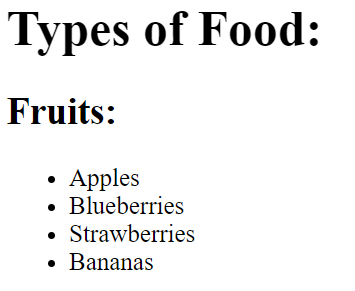

## Básicos React

- Evitar utilizar la palabra *class* para definir clases en **HTML**, en su lugar emplear *className* de esta forma se evitan confusiones con la palabra reservada *class* en Javascript.
- Por convensión todos los atributos de HTML se referencias en JSX con camelCase


## JSX 
JSX retorna un unico elemento. si quiero procesar varios a la vez deben estar envueltos dentro de un elemento padre para cumplir con este principio.

### JSX válido 
```html
<div>
  <p>Paragraph One</p>
  <p>Paragraph Two</p>
  <p>Paragraph Three</p>
</div>
```

### JSX NO válido 
```html
<p>Paragraph One</p>
<p>Paragraph Two</p>
<p>Paragraph Three</p>
```

## Comentarios 

`` {/* comentario aquí */} ``

## Renderizado

React contiene una API de renderizado conocida como ReactDOM

`` ReactDOM.render(componentToRender, targetNode) ``

El primer argumento corresponde con un elemento o un componente que se quiera renderizar y el segundo en nodo del DOm donde se quiere renderizar.

**Ejemplo**


```javascript

const JSX = (
  <div>
    <h1>Hello World</h1>
    <p>Lets render this to the DOM</p>
  </div>
);


ReactDOM.render(JSX, document.getElementById("challenge-node"))

```
---
## Componentes en React

1. Componente sintaxis de función  

Se trata de funciones que devuelven **un elemento** a ser renderizado en el DOM. Estas funciones se hacen reutilizables cuando le pasamos parámetros.

 **IMPORTANTE!** el nombre de esta función debe comenzar con mayúscula

 ```Javascript
const DemoComponent = function() {
  return (
    <div className='customClass' />
  );
};
 ```

2. Componentecon sintaxis de clase
   
```javascript
  class Kitten extends React.Component {
  constructor(props) {
    super(props);
  }

  render() {
    return (
      <h1>Hi</h1>
    );
  }
}

```


 ### Multiples componentes de React

Normalmente se crea un componente padre llamado de normal **App** que renderiza cada uno de los otros componentes (hijos)

```javascript
return (
 <App>
  <Navbar />
  <Dashboard />
  <Footer />
 </App>
)
```

**Componentes anidados**
```javascript
const TypesOfFruit = () => {
  return (
    <div>
      <h2>Fruits:</h2>
      <ul>
        <li>Apples</li>
        <li>Blueberries</li>
        <li>Strawberries</li>
        <li>Bananas</li>
      </ul>
    </div>
  );
};

const Fruits = () => {
  return (
    <div>
      { /* Change code below this line */ }
      <TypesOfFruit />
      { /* Change code above this line */ }
    </div>
  );
};

class TypesOfFood extends React.Component {
  constructor(props) {
    super(props);
  }

  render() {
    return (
      <div>
        <h1>Types of Food:</h1>
        { /* Change code below this line */ }
           <Fruits />
        { /* Change code above this line */ }
      </div>
    );
  }
}; 


```
Resultado



---

## Propiedades o Props en React

Las props son los argumentos que se le pasan al componente de React que se está creando.
Puedo definirlas explicitamente dentro del componente o poner solo **props** y luego acceder a ellas como si de objetos se tratara 

Ejemplo 1
``` javascript

const Welcome = (props) => <h1>Hello, {props.user}!</h1>

<App>
  <Welcome user='Mark' />
</App>

```

Ejemplo 2

``` javascript
const CurrentDate = (props) => {
  return (
    <div>
      { /* Change code below this line */ }
      <p>The current date is: {props.date} </p>
      { /* Change code above this line */ }
    </div>
  );
};

class Calendar extends React.Component {
  constructor(props) {
    super(props);
  }
  render() {
    return (
      <div>
        <h3>What date is it?</h3>
        { /* Change code below this line */ }
        <CurrentDate date={Date()} />
        { /* Change code above this line */ }
      </div>
    );
  }
};
```

### Definir propiedades por defecto

Las propiedades por defecto son valores predeterminados que defino que se utilizarán en caso de que no se especifique ningun valor para dicha propiedad

```Javascript
const ShoppingCart = (props) => {
  return (
    <div>
      <h1>Shopping Cart Component</h1>
    </div>
  )
};
// Change code below this line

ShoppingCart.defaultProps = {
  items: 0
};
```

### Definir test tipo de dato de una prop.

Esto es util en caso de que una prop provenga de una API por ejemplo y lo que esté esperando como valor sea un array, de no venir un array causaría un error por lo que puedo garantizar que lo que esté viniendo lo sea definiendo *propTypes*

```Javascript
MyComponent.propTypes = { handleClick: PropTypes.func.isRequired }
```

En el ejemplo anterior se garantiza que lo que venga sea una funcion

Para **propTypes** booleanos utilizo *bool*, el resto no cambian 

Es necesario importar propTypes independiente de react para que pueda funcionar

``import PropTypes from 'prop-types';``

En caso de que el componente hijo sea The ES6 class component.

debo acceder a las propiedades de modo diferente:
``{this.props.data}``

```javascript
class App extends React.Component {
  constructor(props) {
    super(props);

  }
  render() {
    return (
        <div>
            { /* Change code below this line */ }
            <Welcome name='Yoannet'/>
            { /* Change code above this line */ }
        </div>
    );
  }
};

class Welcome extends React.Component {
  constructor(props) {
    super(props);

  }
  render() {
    return (
        <div>
          { /* Change code below this line */ }
          <p>Hello, {this.props.name} <strong></strong>!</p>
          { /* Change code above this line */ }
        </div>
    );
  }
};
```

---
## Estados en React

Se definen dentro de componentes declarados con clases

se declara como sigue:

``this.state = {}``

Ver declarado dentro de un componente 

```javascript
class StatefulComponent extends React.Component {
  constructor(props) {
    super(props);
    // Only change code below this line
    this.state = {
    firstName : "Yoannet"
    }
    // Only change code above this line
  }
  render() {
    return (
      <div>
        <h1>{this.state.firstName}</h1>
      </div>
    );
  }
};
```

Otra forma de acceder al state es a traves de variables dentro del método render(). 

Notar que que el codigo java script lo puedo poner sin {}, esto es posible porque no estoy dentro del return

```javascript
class MyComponent extends React.Component {
  constructor(props) {
    super(props);
    this.state = {
      name: 'freeCodeCamp'
    }
  }
  render() {
    // Change code below this line
 const name = this.state.name;
    // Change code above this line
    return (
      <div>
        { /* Change code below this line */ }
        <h1>{name}</h1>
        { /* Change code above this line */ }
      </div>
    );
  }
};
```


para modificar el *state* debe hacerse a traves del método *setState()*

quedar'ia algo así 

``this.setState({
  username: 'Lewis'
});``

Visto en un ejemplo:

```javascript
class MyComponent extends React.Component {
  constructor(props) {
    super(props);
    this.state = {
      name: 'Initial State'
    };
    this.handleClick = this.handleClick.bind(this);
  }
  handleClick() {
    // Change code below this line
    this.setState({name:"React Rocks!"})
    // Change code above this line
  }
  render() {
    return (
      <div>
        <button onClick={this.handleClick}>Click Me</button>
        <h1>{this.state.name}</h1>
      </div>
    );
  }
};
```